# DataBridge

**Portfolio case study:** [moeijiro.github.io/portfolio/projects/databridge](https://moeijiro.github.io/portfolio/projects/databridge/) · **Live demo:** not hosted — the app runs locally in a few commands (see below).

**Connect one API to another, and see every record move.** DataBridge pulls records
from a REST API or an incoming webhook. It maps and converts their fields, then
delivers them to another REST API or webhook, either on a schedule or when you
press **Run now**. Every run keeps a log. It shows how far the run got, how many
records went through, and exactly which records failed and why.

It is a focused integration tool, not a general workflow builder. It has four
connectors and a small, named set of transforms, and no scripting language.

> Portfolio project. The demo workspace syncs between built-in demo APIs served by
> the backend itself (`/demo/source/*`, `/demo/destination/*`), so you need no
> external accounts. All customer and order data is generated.

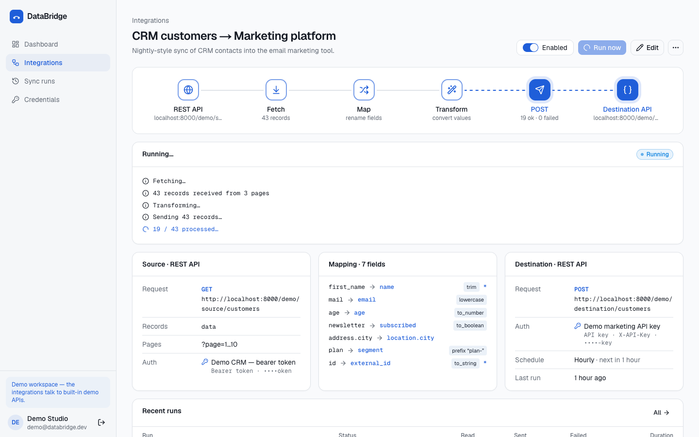

| Dashboard | Run detail with a failed record |
| --- | --- |
| 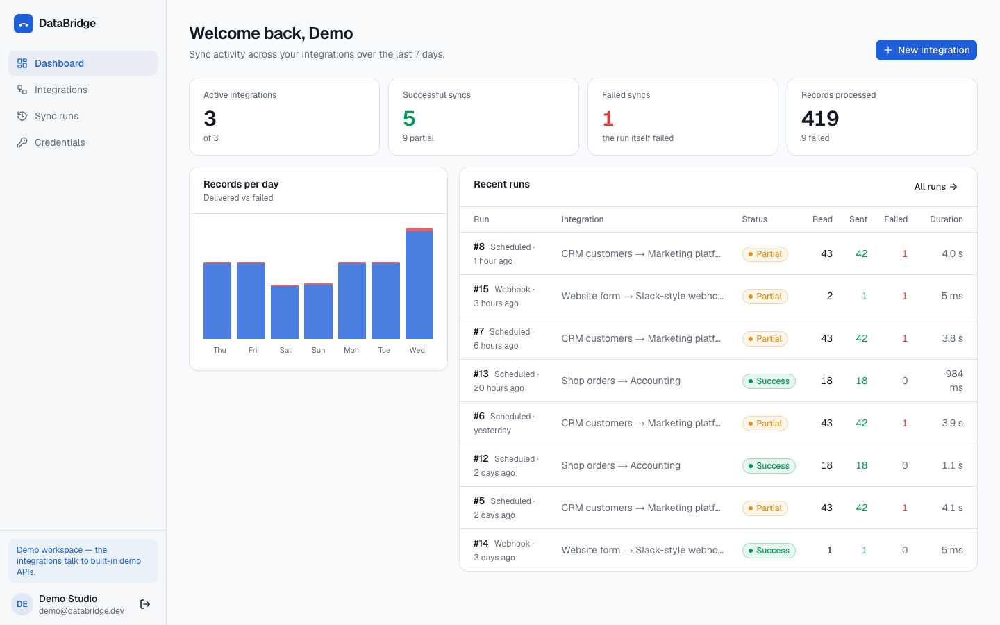 | 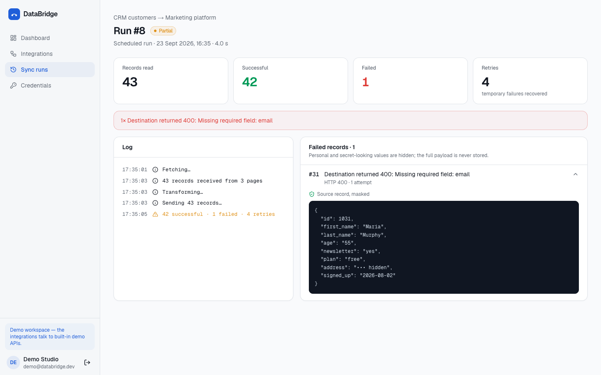 |
| **New integration: test the source, map fields** | **Sync runs** |
| 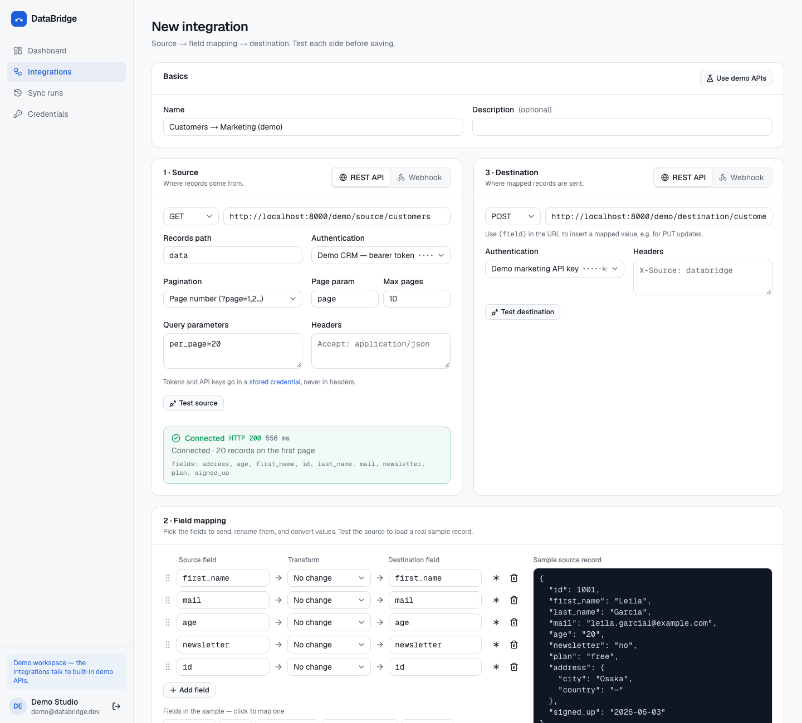 | 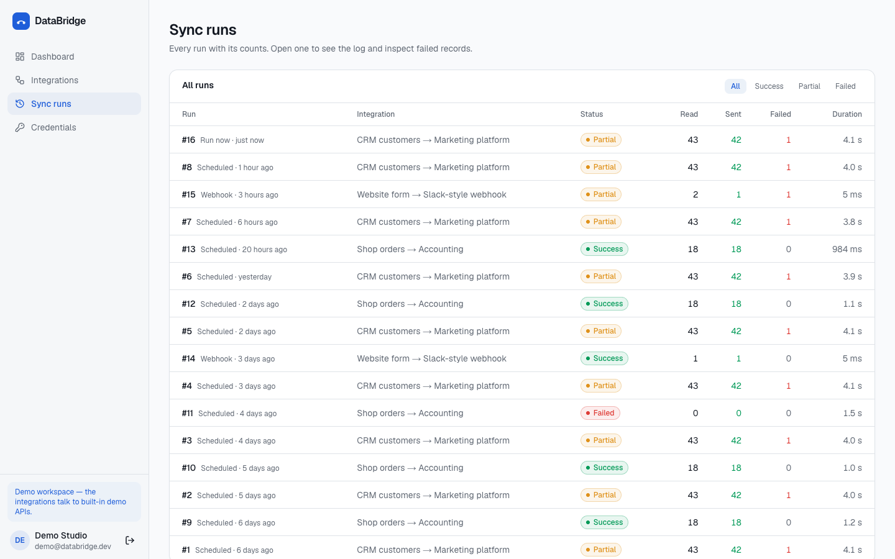 |
| **Integration detail** | **Credentials (encrypted, masked)** |
| 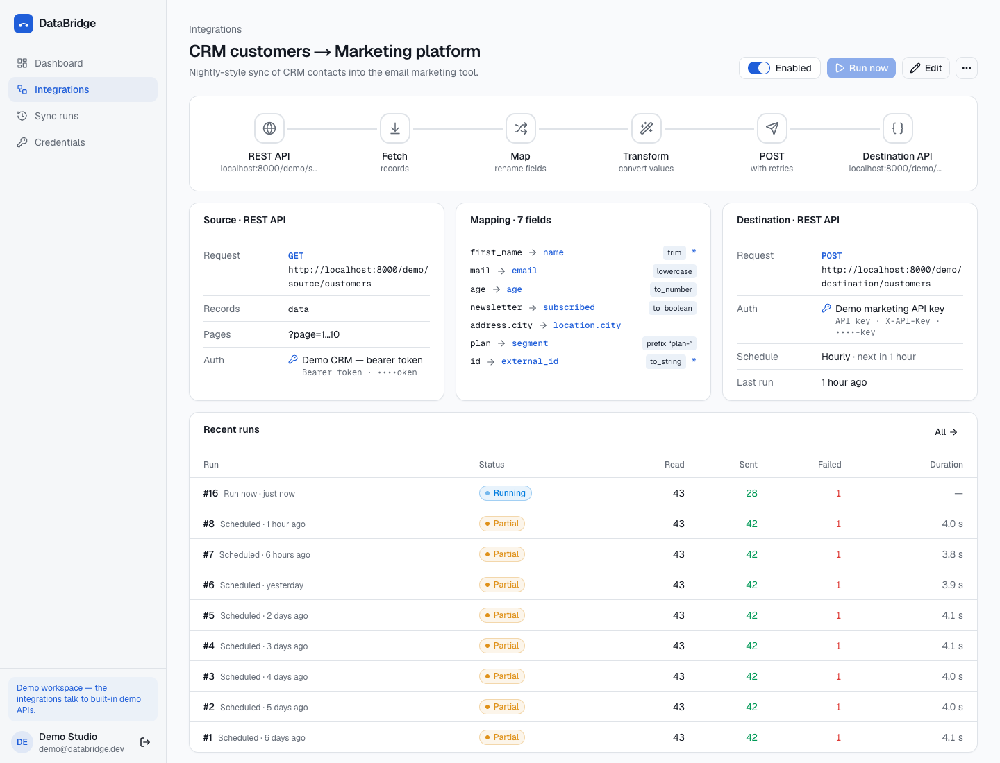 | 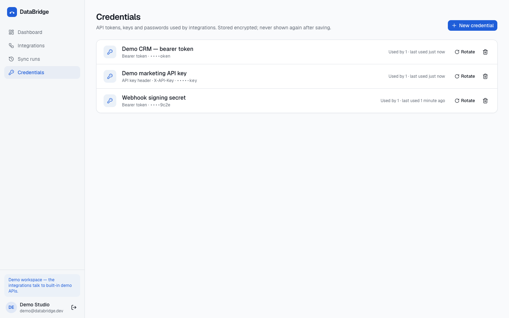 |

<p align="center">
  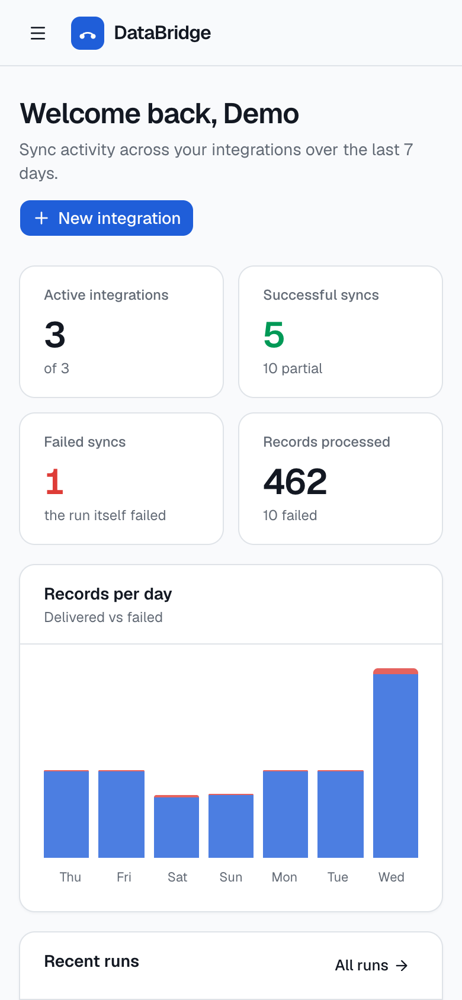
  &nbsp;
  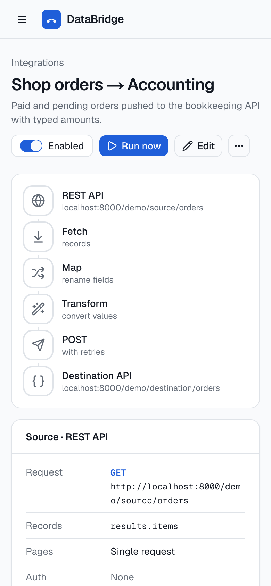
</p>

## Contents

- [Features](#features)
- [Architecture](#architecture)
- [Sync lifecycle](#sync-lifecycle)
- [Field mapping](#field-mapping)
- [Authentication and credentials](#authentication-and-credentials)
- [Security](#security)
- [API overview](#api-overview)
- [Getting started](#getting-started)
- [Demo scenario](#demo-scenario)
- [Testing](#testing)
- [Environment variables](#environment-variables)
- [Known limitations](#known-limitations)

## Features

**Connectors**

| | Source | Destination |
| --- | --- | --- |
| **REST API** | GET/POST. Records at a dotted path (`data`, `results.items`). Optional page-number pagination (up to 50 pages). | POST/PUT/PATCH, one request per record. The URL can contain `{field}` placeholders, e.g. `/contacts/{external_id}`. |
| **Webhook** | A private URL, `POST /hooks/{token}`. Each delivery starts a run. The token can be rotated. | POSTs each record as JSON, signed with HMAC-SHA256 (`X-DataBridge-Signature`). |

**Auth types:** none, bearer token, API-key header and basic auth. Secrets are held in
stored credentials, encrypted at rest, and the API never returns them.

**Field mapping:**
- Pick fields from a live sample record, rename them, and read and write nested paths.
- Mark fields as required and give defaults.
- Transforms: `trim`, `lowercase`, `uppercase`, `prefix`, `suffix`, `to_number`,
  `to_boolean` and `to_string`.
- The preview updates as you type.

**Schedules:** manual, every 15 minutes, hourly or daily. An in-process asyncio
scheduler picks up integrations that are due.

**Runs:**
- **Run now** returns immediately. The integration page then animates the flow
  (fetch, map, transform, send) as the run progresses.
- Each run stores its trigger, stage, and read, processed, successful and failed
  counts, plus retries, duration and a timestamped log.
- **Failed records** show the record index, the stage it failed in, the HTTP status,
  the number of attempts, and a **masked** preview of the source record.

**Retries:** timeouts, network errors, 429 and 5xx responses are retried up to 3 times
with exponential back-off. Any other 4xx is a permanent answer and is never retried.

**Tests before saving:** **Test source** makes the real request and returns the
status, the latency, the record count and a sample. **Test destination** checks
reachability and auth without writing any data.

## Architecture

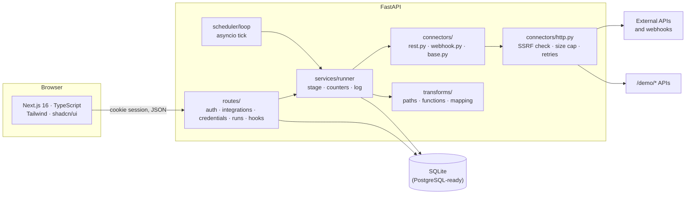

```
backend/app
├── api/routes/     auth, credentials, integrations (+ tests, preview, meta), runs, hooks
├── connectors/     base.py (configs + protocols), rest.py, webhook.py, http.py, auth.py
├── transforms/     paths.py, functions.py, mapping.py
├── scheduler/      schedule.py, loop.py
├── services/       runner.py, credentials.py, masking.py, present.py
├── demo/api.py     local demo source/destination APIs
├── models/         User, Credential, Integration, SyncRun, FailedRecord
└── seed.py         demo workspace with a week of real runs
frontend/src
├── app/            landing, login/register, /app dashboard, integrations, runs, credentials
├── components/app/ flow diagram, mapping editor, integration form, runs table
└── hooks/          use-api, use-run (polls a live run every 400 ms)
```

## Sync lifecycle

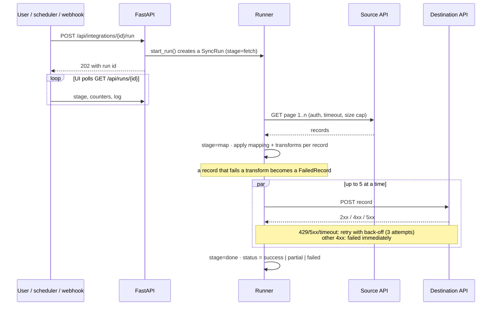

A run ends in one of three states:
- **success**: every record was delivered.
- **partial**: some records failed. They are listed and masked on the run page.
- **failed**: the run itself could not go on, for example because the source
  rejected the credential, the host was unreachable, or the response was too large.

A scheduled integration's `next_run_at` is moved forward *before* its run starts, so
a slow run is never started twice. Only one run per integration goes at a time.

## Field mapping

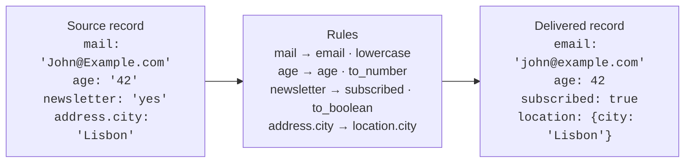

- A rule is `{source, target, transform, argument, required, default}`. Paths are dotted
  and validated.
- `to_number` accepts `"$1,299.50"`. `to_boolean` accepts yes/no, true/false, 1/0 and on/off.
- A value that can't be converted fails **that record only**, with a message that names
  the field. For example: `age: Can't convert "forty" to a number`.
- `POST /api/mapping/preview` applies a mapping to a sample, so the editor shows the
  output or the error live.

## Authentication and credentials

- **Users:**
  - Passwords are hashed with scrypt.
  - Sessions are a JWT in an HttpOnly, SameSite cookie.
  - Login takes constant time whether or not the email exists.
- **Credentials:**
  - Stored once and referenced by id.
  - Each one is one of `bearer`, `api_key` (with its header name) or `basic`.
  - Secrets are encrypted with Fernet. The key is `CREDENTIALS_KEY`, which is
    required in production.
- **The API only ever returns** a hint such as `••••3456`. Editing a credential
  without a new secret keeps the old one; sending a new one rotates it.
- **Secret-looking headers** (`Authorization`, `X-API-Key`, `Cookie`, …) are rejected
  in connector configs, so tokens can't leak into plain JSON.

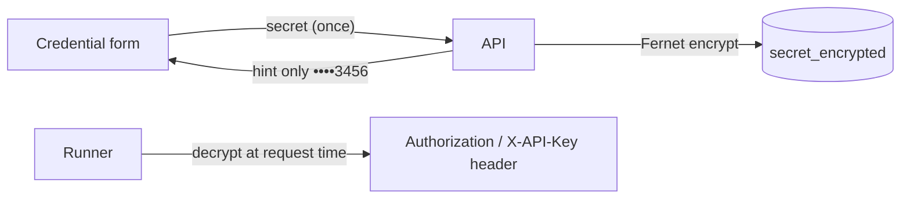

## Security

| Concern | What DataBridge does |
| --- | --- |
| SSRF | Only http(s) URLs, with no userinfo. The host is resolved, and loopback, private, link-local, multicast, reserved and cloud-metadata addresses are refused, as are `localhost`, `.local` and `.internal` names. The address is checked again when the request is actually made. The only exception is the app's own `/demo/*` APIs. |
| Redirects | Never followed, because a redirect could point somewhere internal. |
| Size limits | Responses are streamed and capped at `MAX_RESPONSE_MB` (default 5). A run reads at most `MAX_RECORDS_PER_RUN` records. Webhook payloads are limited to 1 MB. |
| Ownership | Every integration, run, failure and credential query is scoped to the current user. Anyone else gets a 404, not a 403. |
| Secrets | Encrypted at rest and never returned. Failed-record previews hide values whose keys look personal or secret (email, phone, address, token, password…). |
| Webhooks | Each source token is 32 random bytes; the database stores only its SHA-256 for lookup. Deliveries are rate-limited per token. Outgoing webhooks are HMAC-signed over `timestamp.body`. |
| Abuse | Login and registration are rate-limited. Errors use one JSON envelope, `{"error": {"code", "message", "fields"}}`. |

## API overview

Interactive docs are at `http://localhost:8000/docs`.

| Method | Path | |
| --- | --- | --- |
| POST | `/api/auth/register`, `/api/auth/login`, `/api/auth/logout` | Session cookie |
| GET | `/api/me` | Current user |
| GET/POST | `/api/integrations` | List / create |
| GET/PUT/PATCH/DELETE | `/api/integrations/{id}` | Read / replace / toggle / delete |
| POST | `/api/integrations/{id}/run` | **Run now** → `202` with the run |
| POST | `/api/integrations/{id}/rotate-webhook` | New inbound URL |
| POST | `/api/connections/test-source` | Status, latency, count, sample (no save) |
| POST | `/api/connections/test-destination` | Reachability and auth (no write) |
| POST | `/api/mapping/preview` | Apply a mapping to a sample |
| GET | `/api/meta` | Transforms, schedules, demo endpoints |
| GET | `/api/runs`, `/api/runs/{id}`, `/api/runs/{id}/failures` | History, live stage, masked failures |
| GET | `/api/dashboard` | Totals and a 7-day chart |
| GET/POST/PATCH/DELETE | `/api/credentials[/{id}]` | Credentials (secret write-only) |
| POST | `/hooks/{token}` | Inbound webhook → `202` with `run_id` |

## Getting started

Requirements: Python 3.12+ and Node 20+.

```bash
make install        # backend venv + frontend deps
make seed           # demo workspace (resets the local SQLite database)
make api            # http://localhost:8000
make web            # http://localhost:3000
```

Without make:

```bash
cd backend && python3 -m venv .venv && .venv/bin/pip install -r requirements-dev.txt
cp ../.env.example ../.env
.venv/bin/python -m app.seed --reset
.venv/bin/uvicorn app.main:app --port 8000
cd ../frontend && npm install && npm run dev
```

Sign in at `/login?demo=1` as **demo@databridge.dev / databridge-demo-1234**.

To use PostgreSQL, set `DATABASE_URL=postgresql+psycopg://…` and install a driver.
The models use only portable types (JSON, a timezone-aware datetime decorator).

## Demo scenario

The seed creates three integrations and a week of real runs:

1. **CRM customers → Marketing platform** (hourly).
   - Reads 43 customers across 3 pages with a bearer token.
   - Maps 7 fields: trims names, lowercases emails, converts age and the newsletter
     flag, nests the city, and adds a `plan-` prefix.
   - Delivers with an API key.
   - Customer #31 has no email, so the destination returns
     `400 Missing required field: email`. That record appears on the run page,
     masked.
   - A few records hit a one-off 503 and succeed on retry.
2. **Shop orders → Accounting** (daily).
   - Reads `results.items` and converts amounts and paid flags.
   - One seeded run fails because the source was down (503 after 3 attempts).
3. **Website form → Slack-style webhook**.
   - An inbound webhook source forwards form posts to a signed outgoing webhook.
   - Try it with the `curl` command shown on the integration page.

Open the first integration and press **Run now** to watch the flow animate and the log
fill in.

## Testing

```bash
make test           # 39 tests
```

Outbound HTTP is routed back into the app with `httpx.ASGITransport`, so the tests
exercise the real demo APIs with no network access. Retry delays and demo latency are
set to zero.

- **Transforms:**
  - renames
  - nested paths
  - number and boolean conversion
  - prefix, suffix and case
  - error messages that name the field
  - required fields and defaults
  - rule validation
- **Sync:**
  - pagination across every page
  - masked failed records
  - retrying 5xx until it succeeds
  - giving up after the configured attempts
  - a bad source credential failing the whole run
  - transform failures recorded per record
  - webhook source runs
  - the scheduler picking up due integrations
- **Security:**
  - encrypted, never-returned secrets
  - cross-user 404s
  - internal targets refused (loopback, private, metadata, `.internal`)
  - secret headers rejected
  - connection tests that don't leak secrets
  - mapping preview errors
  - webhook sources can't be scheduled

CI runs the backend tests, then lints and builds the frontend
([.github/workflows/ci.yml](.github/workflows/ci.yml)).

## Environment variables

See [.env.example](.env.example). The ones that matter:

| Variable | Default | |
| --- | --- | --- |
| `DATABASE_URL` | `sqlite:///./databridge.db` | Any SQLAlchemy URL |
| `SECRET_KEY` | dev value | Signs sessions |
| `CREDENTIALS_KEY` | derived in dev | Fernet key for stored secrets. **Required in production** |
| `PUBLIC_API_URL` | `http://localhost:8000` | Used for webhook URLs and the demo-API exception |
| `HTTP_TIMEOUT_SECONDS` | `15` | Per request |
| `MAX_RESPONSE_MB` | `5` | Response size cap |
| `MAX_RECORDS_PER_RUN` | `5000` | |
| `RETRY_ATTEMPTS` / `RETRY_BASE_DELAY_SECONDS` | `3` / `0.5` | Back-off doubles each attempt |
| `SCHEDULER_ENABLED` / `SCHEDULER_TICK_SECONDS` | `true` / `30` | |

## Known limitations

- The scheduler runs inside the API process. Running several API replicas would
  need a lock or an external queue.
- Pagination is page-number only; there is no cursor or `Link` header support yet.
- Records are sent one request per record. There is no batch endpoint support.
- There is no incremental sync (updated-since) and no de-duplication. Each run sends
  everything the source returns.

## Deployment

There is no hosted instance; the project is set up to deploy as separate processes:

- **API:** `uvicorn app.main:app --host 0.0.0.0 --port 8000` with `ENVIRONMENT=production`. The app refuses to start in production if `SECRET_KEY` is weak, `CREDENTIALS_KEY` is missing or `COOKIE_SECURE` is false.
- **Web:** `cd frontend && npm ci && npm run build && npm start`, with `NEXT_PUBLIC_API_URL` pointing at the API.
- **One API instance:** the scheduler runs inside the API process, so run a single instance (or `SCHEDULER_ENABLED=false` on all but one).
- **Database:** `DATABASE_URL` takes any SQLAlchemy URL. The project is developed and tested on SQLite.
- **Cookies:** serve the web app and the API from the same site (for example `app.example.com` and `api.example.com`) so the SameSite session cookie is sent, and set `COOKIE_SECURE=true` behind HTTPS.

## License

MIT © Moeijiro
